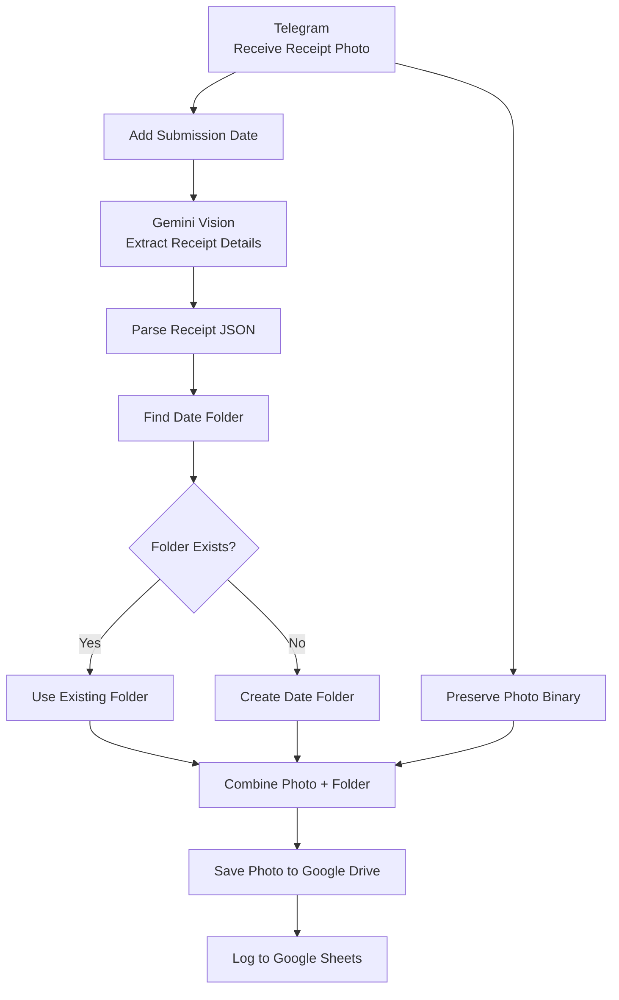

# Telegram Receipt Processor

## Overview

An n8n workflow that automatically processes receipt photos sent through Telegram.

The workflow uses Google Gemini to extract receipt details, saves the original photo to Google Drive by submission date, and logs the extracted information with a Drive link in Google Sheets.

## Workflow



## Features

- Telegram receipt photo processing
- Gemini Vision receipt extraction
- Merchant, amount, and receipt date extraction
- Automatic Google Drive archiving
- Date-based folder organization
- Google Sheets logging
- Direct Google Drive file link
- Retry handling for Google Sheets writes

## Archive Structure

```text
Receipts/
└── <submission-date>/
    └── receipt_<timestamp>.jpg
```

### Example

```text
Receipts/
└── 2026-09-06/
    └── receipt_20260906_003510.jpg
```

## Tech Stack

[](https://n8n.io/)
[](https://telegram.org/)
[](https://ai.google.dev/)
[](https://drive.google.com/)
[](https://sheets.google.com/)
[](https://developer.mozilla.org/en-US/docs/Web/JavaScript)